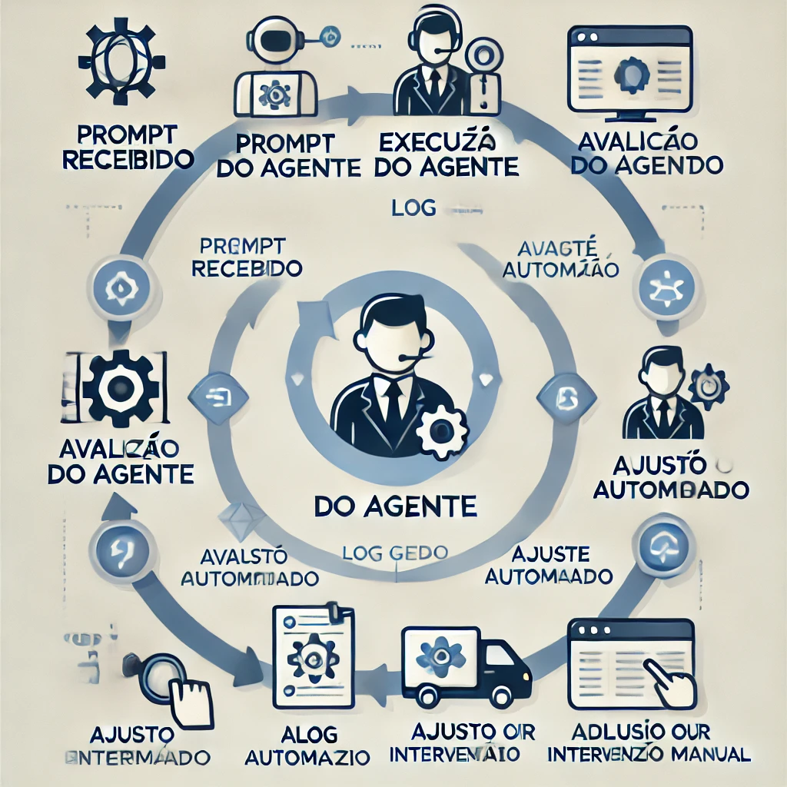
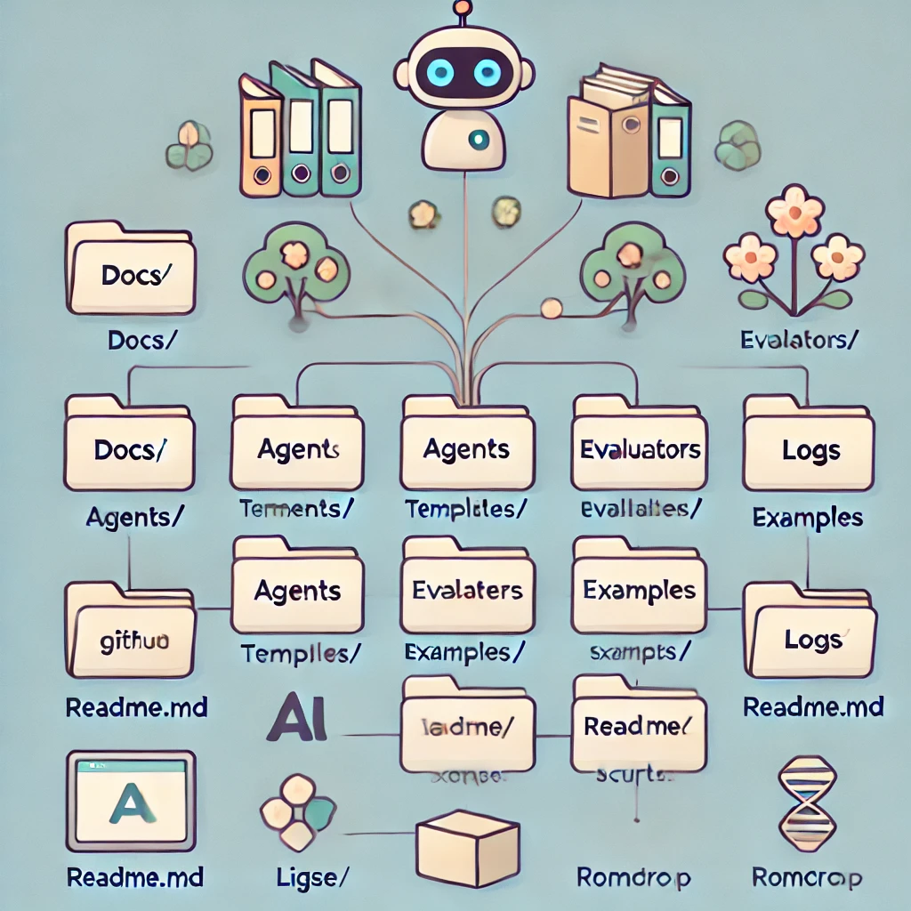
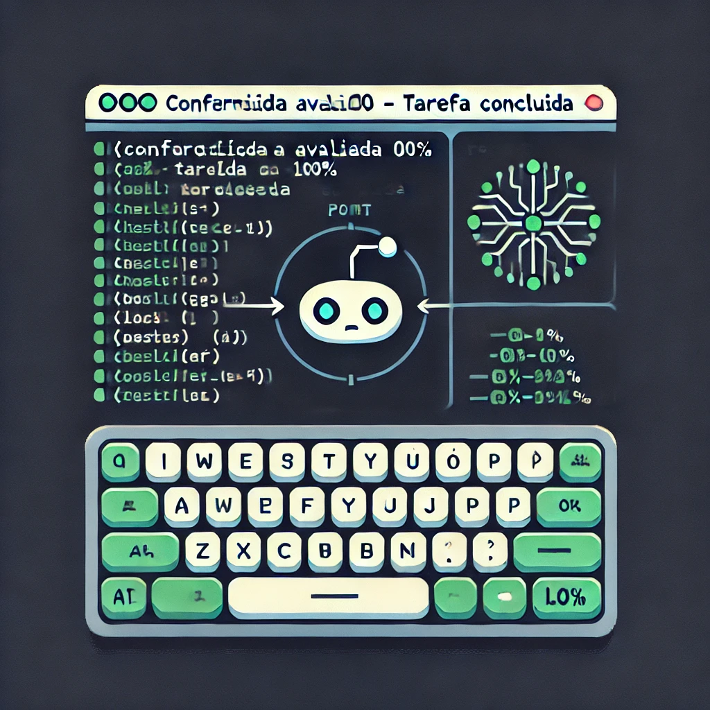
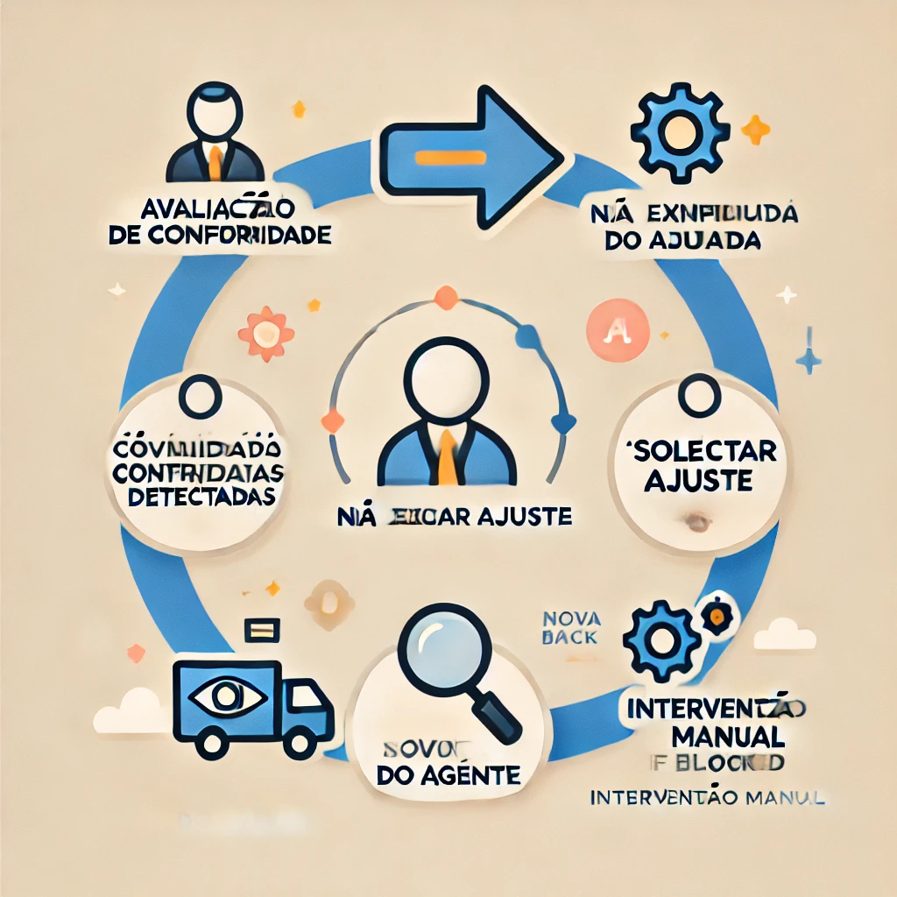

# AgentFlowCraft

> Estrutura automatizada para criação, execução, avaliação e conformidade de múltiplos agentes de IA orientados a microtarefas, com registro e rastreamento completo.

---

## ✅ Status do projeto

[](https://github.com/Malnati/agent-flow-craft/actions/workflows/check-assets.yml)
[](https://github.com/Malnati/agent-flow-craft/actions/workflows/lint-python.yml)
[](https://github.com/Malnati/agent-flow-craft/actions/workflows/check-markdown.yml)
[](https://github.com/Malnati/agent-flow-craft/actions/workflows/check-yaml.yml)

---

## 📚 Contextualização do Projeto
Este repositório nasce de uma análise comparativa das principais ferramentas de desenvolvimento de agentes de IA (LangChain, LangFlow, AutoGen, CrewAI e Agno), avaliando popularidade, comunidade ativa e frequência de commits.

O objetivo principal é criar agentes de IA para execução autônoma de microtarefas, automatizando fluxos e utilizando inteligência artificial para replicar e acelerar o trabalho humano.

---

## 🚀 Tecnologias consideradas para o projeto
Abaixo, a lista de ferramentas consideradas durante a análise para compor o ecossistema deste projeto:

| Ferramenta      | Motivo de consideração                                     |
|-----------------|------------------------------------------------------------|
| **LangChain**   | Popularidade, comunidade ativa e frequência alta de commits. |
| **LangFlow**    | Interface visual para composição de fluxos de agentes.     |
| **AutoGen (MS)**| Robustez, confiabilidade e forte suporte institucional.    |
| **Agno (ex-Phidata)** | Flexibilidade para construção de agentes customizados.|
| **CrewAI**      | Colaboração entre múltiplos agentes com orquestração.     |
| **UV**          | Gerenciador de ambientes Python ágil e eficiente.         |
| **Cursor IDE**  | Ambiente de desenvolvimento altamente produtivo.          |
| **Aider**       | Assistente IA para desenvolvimento contextualizado.       |

### 📊 Comparativo de Popularidade e Atividade (dados coletados em 24 de março de 2025)

| Ferramenta      | Estrelas (⭐) | Contribuidores | Commits/Semana (últimos 6 meses) |
|-----------------|--------------|----------------|----------------------------------|
| **LangChain**   | ~104.000     | 3.529          | ~75                              |
| **LangFlow**    | ~52.800      | 262            | ~85                              |
| **AutoGen (MS)**| ~42.100      | 483            | ~80                              |
| **CrewAI**      | ~29.000      | 229            | ~30                              |
| **Agno**        | ~21.800      | 139            | ~40                              |

> **Conclusão**: O **LangChain** é a ferramenta mais popular e ativa, com grande comunidade. O **AutoGen** da Microsoft destaca-se pela confiabilidade e suporte contínuo. No momento, a tendência é utilizar o **AutoGen**, pela tradição da Microsoft em manter ferramentas bem documentadas e com suporte duradouro, mas o LangChain permanece como forte alternativa.

---

## 🛠 Estrutura dos agentes
Cada agente conterá:
- Registro do prompt inicial.
- Linha de raciocínio da IA (quando suportado pelo modelo).
- Log detalhado da execução.
- Arquivo `conformities.yaml` com parâmetros de conformidade.
- Avaliador automático de conformidade.
- Executor de ajustes automáticos.
- Mecanismo de fallback para intervenção manual.

---

## 📂 Estrutura planejada do repositório
```
agent-flow-craft/
│
├── docs/
├── agents/
├── templates/
├── evaluators/
├── logs/
├── examples/
├── config/
├── scripts/
├── .github/
├── README.md
├── CONTRIBUTING.md
├── LICENSE
└── roadmap.md
```

---

## 🗺 Roadmap
Consulte o [roadmap completo](./roadmap.md) para ver as etapas em andamento, próximas metas e o ciclo de releases.

---

## 📸 Demonstrações visuais

### ✅ Ciclo de vida do agente


### ✅ Estrutura de pastas do projeto


### ✅ Execução simulada de um agente em terminal


### ✅ Ciclo de avaliação e feedback do agente


---

## 🧩 Templates disponíveis

O projeto oferece templates prontos para:
- Relato de bugs: [Bug Report Template](.github/ISSUE_TEMPLATE/bug_report.md)
- Sugestões de novas funcionalidades: [Feature Request Template](.github/ISSUE_TEMPLATE/feature_request.md)
- Pull Requests: [Pull Request Template](.github/PULL_REQUEST_TEMPLATE.md)

---

## 🌐 Comunidade e Recursos

[](./CONTRIBUTING.md)
[](./CODE_OF_CONDUCT.md)
[](./roadmap.md)
[](./SUPPORT.md)
[](../../issues)

---

## 🛡 Segurança

Para detalhes sobre como relatar vulnerabilidades, consulte o nosso [SECURITY.md](./SECURITY.md).

---

## 💡 Contribua com a comunidade
Se você gosta do projeto, ⭐ favorite o repositório, compartilhe com colegas e participe das discussões e melhorias!

---

## 📣 Divulgação e engajamento

- Use a hashtag **#AgentFlowCraft** no Twitter e LinkedIn.
- Participe das discussões (em breve) na aba Discussions do GitHub.
- Acompanhe atualizações e releases pelo [roadmap](./roadmap.md).

---

## 📅 Última atualização deste README
Este arquivo foi atualizado pela última vez em: **24 de março de 2025**.
